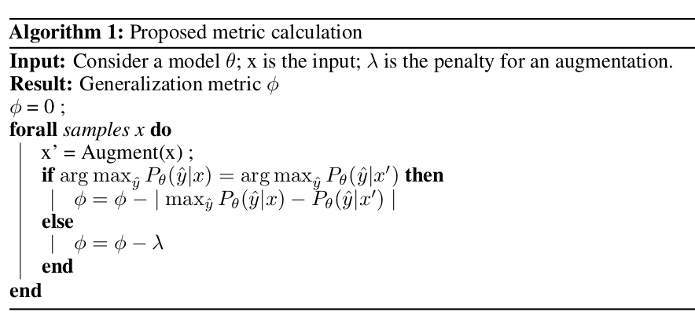
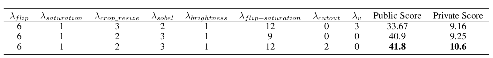
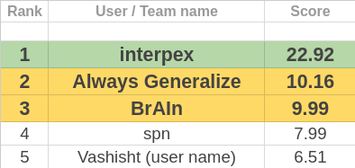

## One Sentence Summary
In this work, we developed a simple yet effective method to predict the generalization performance of a model by using the concept that models that are robust to augmentations are more generalizable than those which are not.
## Abstract
Generalization is the ability of a model to predict on unseen domains and is a fundamental task in machine learning. Several generalization bounds, both theoretical and empirical have been proposed but they do not provide tight bounds. In this work, we propose a simple yet effective method to predict the generalization performance of a model by using the concept that models that are robust to augmentations are more generalizable than those which are not. We experiment with several augmentations and composition of augmentations to check the generalization capacity of a model. We also provide a detailed motivation behind the proposed method. The proposed generalization metric is calculated based on the change in the model’s output after augmenting the input. The proposed method was the first runner up solution for the competition "Predicting Generalization in Deep Learning".
## About the Competition
The generalization gap of a model is defined as the difference between the estimated risk of a target function and the empirical risk of a target function. \
The task of the competition was to predict the generalization of a model through a complexity measure that maps the model and dataset to a real number. This real number indicates the generalization ability of the model. The models are ranked based on the consistency with the actual generalization performance. \
More details about the competition can be found in the [Competition website](https://sites.google.com/view/pgdl2020).\
Details of the tasks and evaluation metric can be found in [this paper](https://arxiv.org/pdf/2012.07976.pdf).
## Paper Summary
### Motivation
The proposed method is based on a simple hypothesis that a model capable of generalizing must be robust to augmentations.
A model’s output should not change significantly when certain augmentations are performed on the input. 
The model should confidently predict the augmented input if it has learned the correct features of a particular class.
### Proposed Metric
For every sample, we augment the input and then compare the class prediction of the model for the original input and augmented input. If the class
prediction is the same even after the input is augmented, then we add a penalty equal to the difference between probabilities of the predicted class
on the original and augmented input.

### Results
The metric used in the competition was Conditional Mutual Information as described in [this paper](https://arxiv.org/pdf/2012.07976.pdf).\
**Higher the score, the better the generalization metric**.\
\

### Conclusion
This method tests the model with augmented samples from the training data and penalizes models that are unable to correctly classify augmented
samples. We have also provided an insight into the role of augmentations in testing the generalizability of a model.

## [\[Paper\]](https://arxiv.org/abs/2101.06459) [\[Video\]](https://slideslive.com/38942495/robustness-to-augmentations-as-a-generalization-metric) [\[Code\]](https://github.com/sumukhaithal6/pgdl)